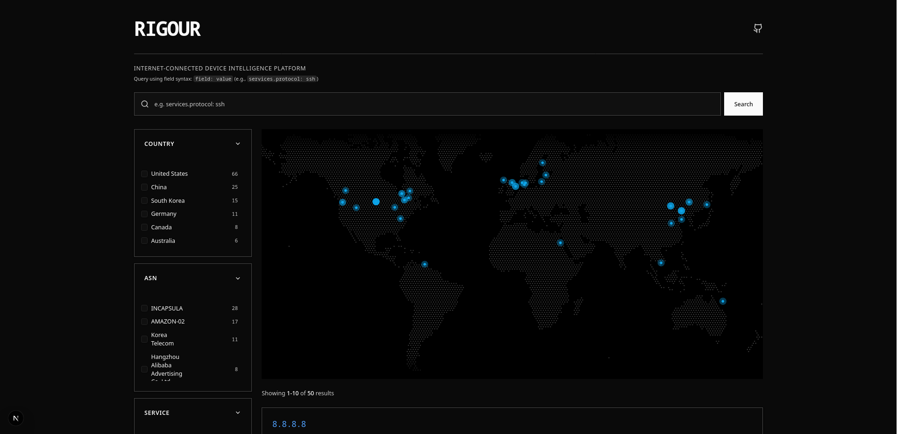

# Rigour: An IoT Search Engine

[](LICENSE)
[](https://github.com/ctrlsam/rigour/issues)
[](https://github.com/ctrlsam/rigour)

Rigour is a comprehensive Internet of Things (IoT) scanning tool designed to discover, analyze, and report on devices connected to the internet. Rigour performs large-scale network scans to identify active hosts, retrieve service banners, and detect potential vulnerabilities. Rigour was inspired by [Shodan.io](https://www.shodan.io/), a popular IoT search engine. If you find this project useful, please consider starring the repository!

> [!WARNING]
> Rigour is intended for ethical use only. Always obtain permission before scanning networks and devices that you do not own. Use this tool responsibly and in compliance with all applicable laws and regulations.


## Get Started

Before you begin, ensure you have the necessary prerequisites installed on your system.

### Prerequisites

* [Docker](https://www.docker.com/get-started)
* [Docker Compose](https://docs.docker.com/compose/install/)
* [MaxMind Account](./docs/MAXMIND_SETUP.md)

### Installation Steps

1. **Clone the Repository**:

   ```bash
   git clone https://github.com/ctrlsam/rigour.git
   cd rigour
   ```

### Run with Docker (Recommended)

1. **Configure Environment Variables**:
   Create a `.env` file under the root directory and set the required environment variables as per the instructions in `.env.example`.
   You will also want to set what IP range you want to scan. By default this is set as the ENTIRE internet so be careful!

   ```bash
    cp .env.example .env
    nano .env
    ```

2. **Run with Docker Compose**:
   Ensure you have Docker and Docker Compose installed. Then, run:

   ```bash
   docker compose up -d
   ```

3. **Access the UI**:
    Open your web browser and navigate to `http://localhost:3000` to access the Rigour web interface.

4. **Stop the Services**:
    To stop the services, run:
    ```bash
    docker compose down
    ```

## Architecture Overview

Rigour's architecture comprises several interconnected components that work in harmony to perform comprehensive network scanning and analysis.

### Components

#### Crawler

The Crawler is responsible for performing large-scale network scans using [Naabu](https://github.com/projectdiscovery/naabu) and fingerprinting the discovered devices with [Fingerprintx](https://github.com/praetorian-inc/fingerprintx). Results from this are published to Kafka for further processing. The microservice design was chosen to support multiple worker nodes in the future.

#### Persistence

The Persistence component consumes scan results and enriches them with other data sources such as ASN and location info from GeoIP. It then stores the enriched data in a MongoDB database. This allows for efficient querying and retrieval of scan data for analysis and reporting.

#### API

The API component provides a RESTful interface for accessing scan data stored in MongoDB. It serves as the backend for the Rigour UI, enabling users to query and retrieve scan results.

#### User Interface

The Rigour UI provides an intuitive interface for viewing scan results. You can filter and search for specific devices, view detailed information about each device, and export scan results for further analysis. The app is build using Next.js and communicates with the API to fetch data.



## REST API Documentation

### `GET /api/hosts/search`

- **Description**: Search for hosts based on query parameters.
- **Query Parameters**:
    - `filter` (optional, string): A JSON-encoded MongoDB-style query object used to filter hosts. The server applies this object directly as a MongoDB $match stage.
    - `limit` (optional, integer): Maximum number of hosts to return. Defaults to 50. Minimum/invalid values default to 50. Maximum allowed value is 500.
    - `page_token` (optional, string): Opaque pagination token returned from a previous response next_page_token. Pass this token to retrieve the next page of results.

### `GET /api/facets`

- **Description**: Retrieve available facets for filtering search results.
- **Query Parameters**:
    - `filter` (optional, string): A JSON-encoded MongoDB-style query object to restrict the aggregation to a subset of hosts.

## Acknowledgements

We would like to thank the open-source community for their contributions and support in developing Rigour.

Special thanks to the creators of [Fingerprintx](https://github.com/praetorian-inc/fingerprintx) and [Naabu](https://github.com/projectdiscovery/naabu) for their invaluable tools and resources.
